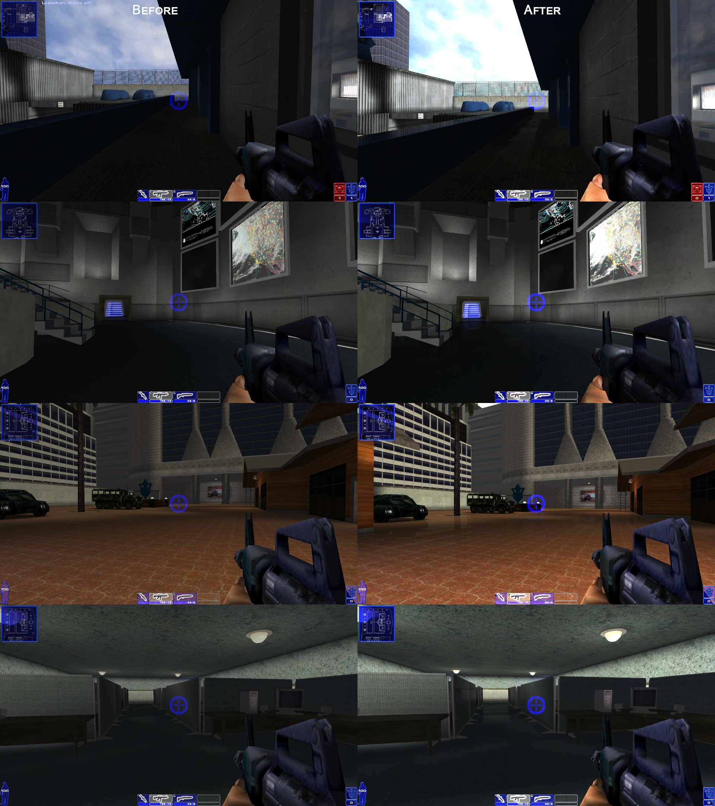

# MF-Extras

## d3d8to9 — 60 FPS Limit Patch

This patch adds a **60 FPS frame rate limit** to `d3d8to9`.

### Changes

- Adds a `LimitFramerateTo60FPS()` function.
- Limits frames to approximately **60 FPS**.
- Applies the limit to:
  - `Direct3DDevice8::Present()`
  - `Direct3DSwapChain8::Present()`
- Uses high-precision Windows timing for consistent frame pacing.
- Adds the function declaration to `d3d8types.hpp`.
- Adds a Visual Studio `.vcxproj.user` file.

### Result

The game/application is limited to approximately **60 FPS** without changing the main Direct3D 8 → Direct3D 9 functionality.

## ReShade Mod — Graphics Configuration

This mod adds a custom **ReShade configuration** with several visual effects and a 30 FPS frame rate limiter.



### Features

- FXAA anti-aliasing
- HDR effects
- MXAO ambient occlusion
- SSR screen-space reflections
- Eye adaptation
- Depth of field
- Sharpening
- Color grading
- Bloom and lighting effects
- Debanding
- Film effects
- ReShade frame rate limiter

### Active Effects

The current configuration uses:

- `FXAA`
- `FakeHDR`
- `qUINT_mxao`
- `qUINT_ssr`
- `EyeAdaption`
- `FocalDOF`

### Frame Rate Limit

The configuration includes `FramerateLimiter.fx` with:

```ini
[FramerateLimiter.fx]
Framerate=30.000000
